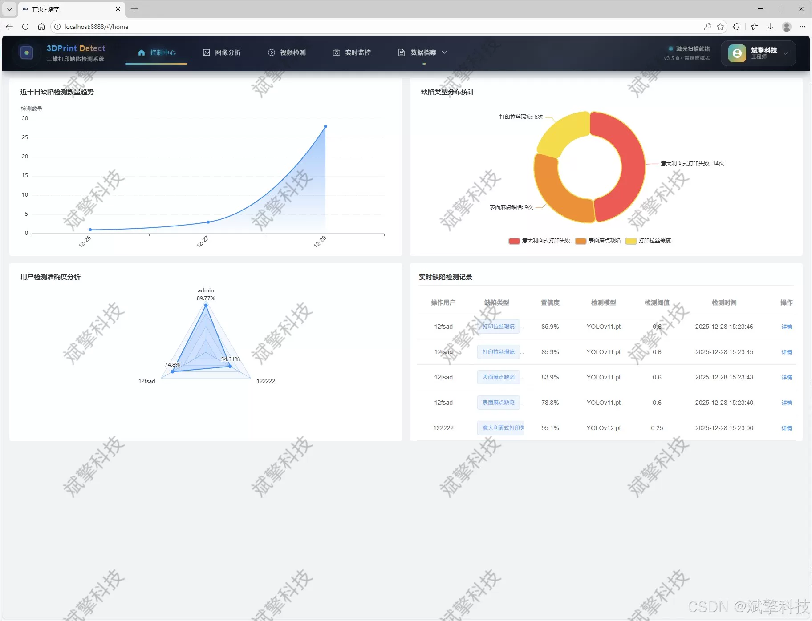
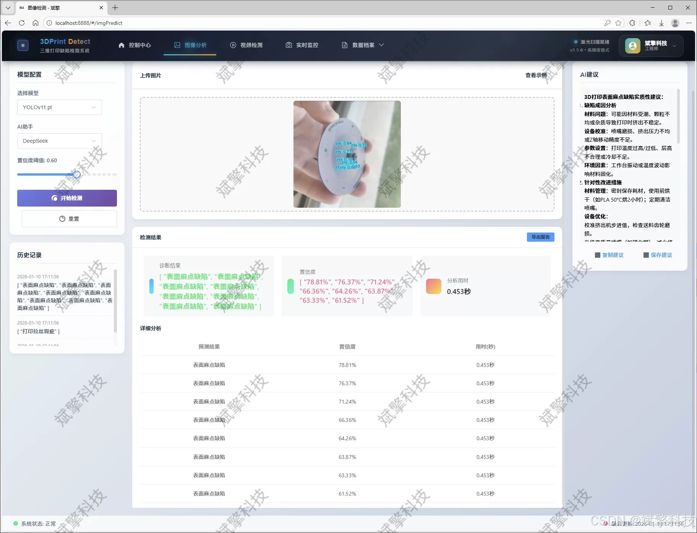
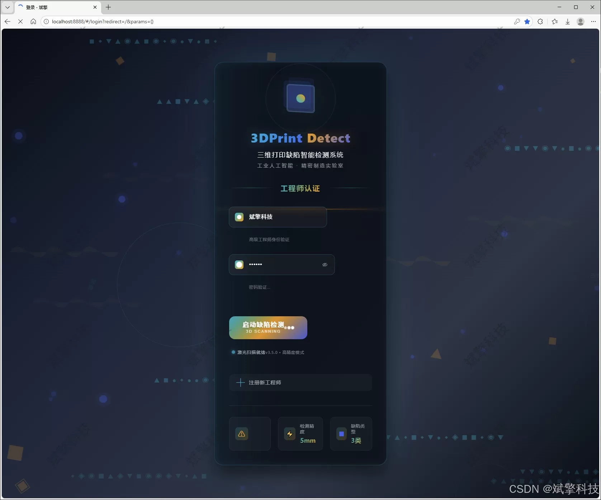
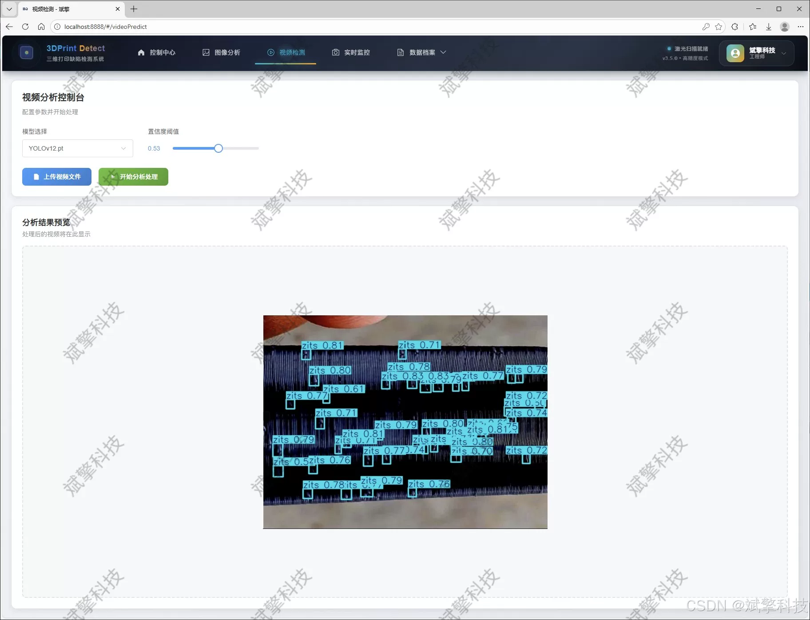
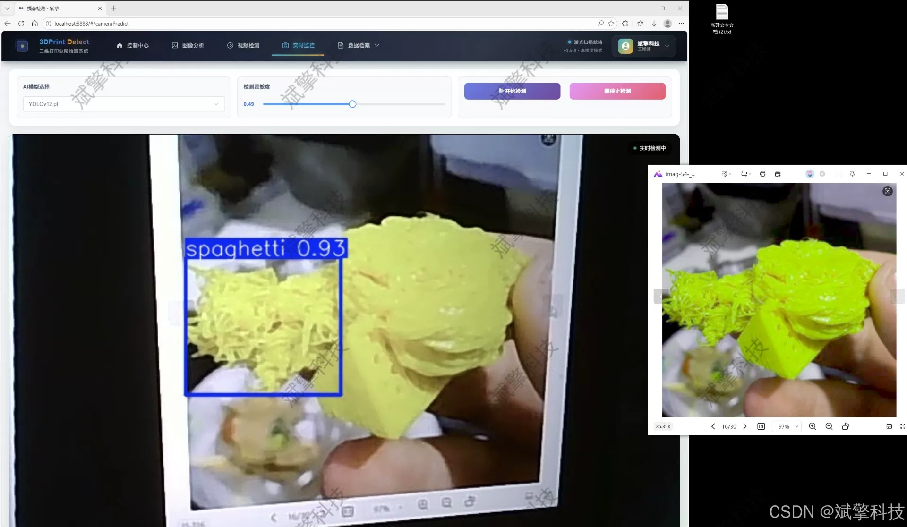
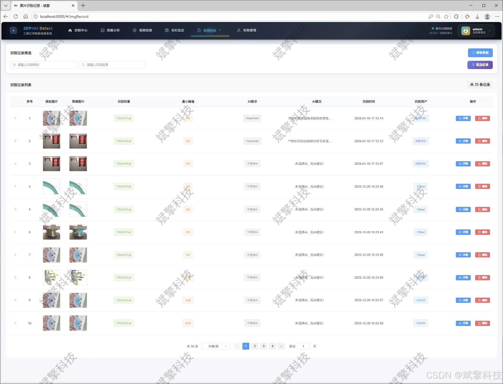
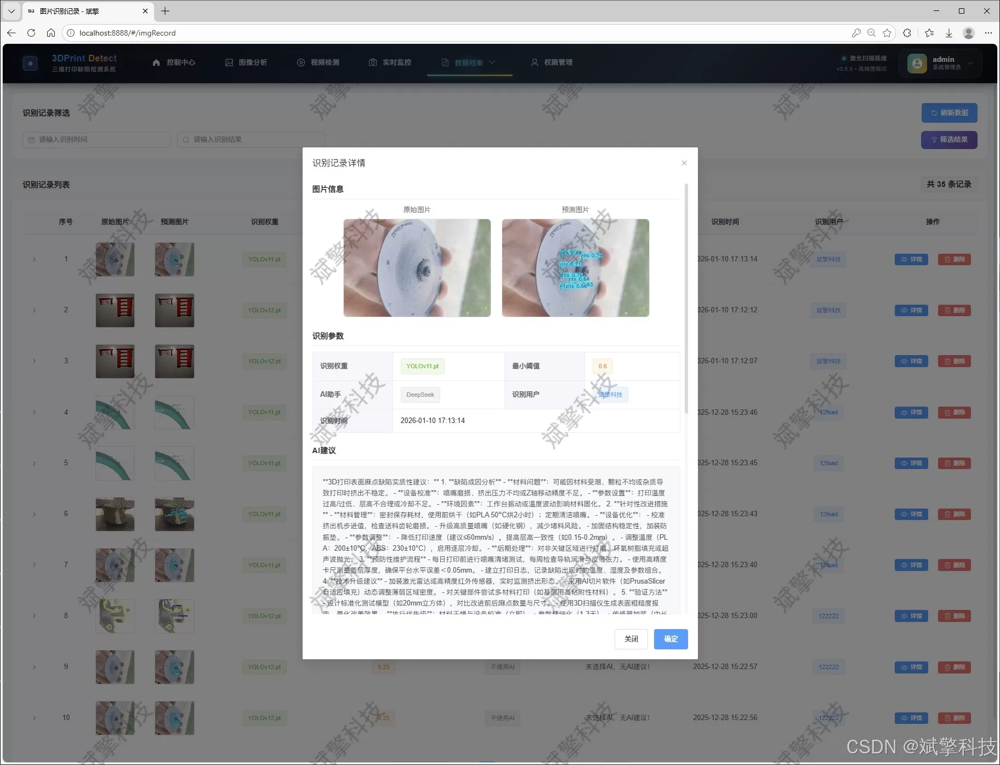
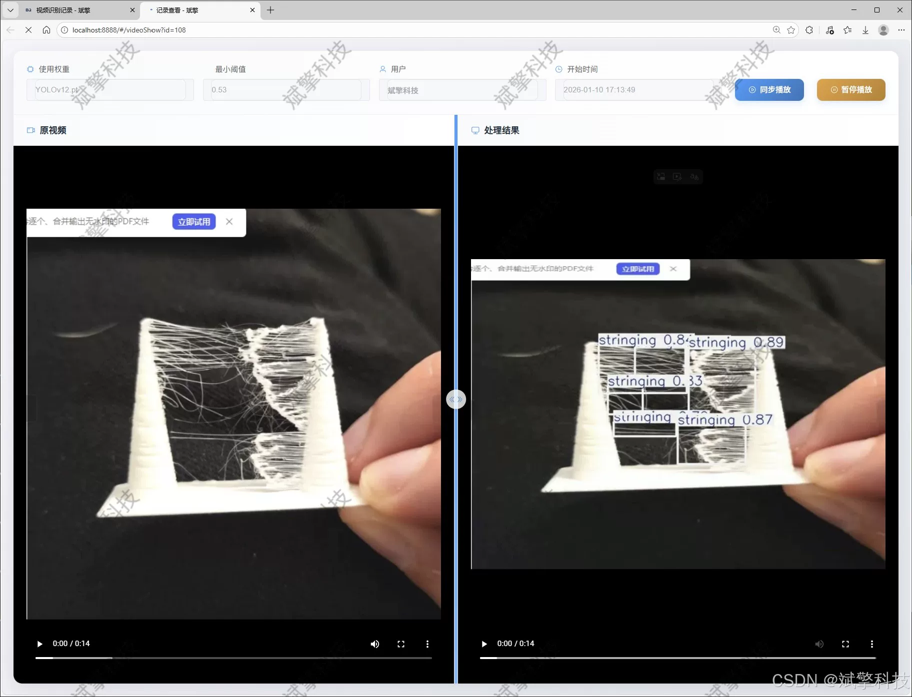
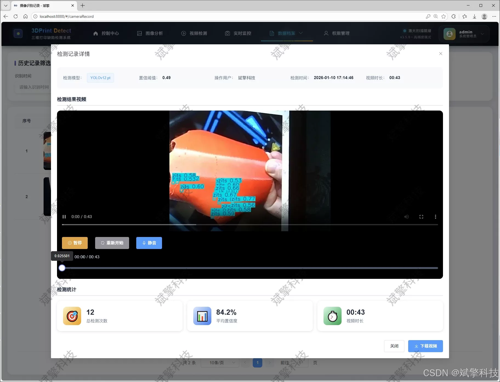

# YOLO+DeepSeek 3D printing defects

## Body

YOLO+DeepSeek 3D printing defect detection system based on YOLO deep learning and the large models of Qianwen and DeepSeek (DeepSeek intelligent analysis + web interaction interface + front-end separation + YOLO data + YOLOv8/YOLOv10/YOLOv11/YOLOv12)

With the widespread application of 3D printing technology, the automatic detection and control of its print quality have become a crucial link in ensuring manufacturing efficiency and product quality. Traditional defect detection methods rely on manual visual inspection, which are inefficient, subjective, and difficult to achieve continuous monitoring. This study proposes and implements an intelligent online defect detection system for 3D printing based on deep learning and Web technology. The core of the system adopts advanced YOLOv8/YOLOv10/YOLOv11/YOLOv12 object detection algorithms to perform high-precision recognition and localization of three common printing defects (ribboning, burrs, and hanging). The system is built on the back end using the SpringBoot framework, adopting a front-end-back-end separation architecture. The front end provides a friendly interaction interface, achieving functions such as user management, multimodal detection (images, videos, real-time cameras), and record traceability. The system innovatively integrates the DeepSeek large language model to provide intelligent analysis and interpretation of the detection results, enhancing the system's understandability and decision support capabilities. Experimental results show that this system performs exceptionally well on a dataset containing nearly 6000 labeled images, capable of stably and efficiently completing defect detection tasks. The results are also visualized through a management platform and stored persistently in a MySQL database, providing a complete solution for intelligent quality monitoring in the 3D printing process.

Functional module

✅ User Login and Registration: Supports password detection, saves to MySQL database.

✅ Supports four YOLO model switches, YOLOv8, YOLOv10, YOLOv11, YOLOv12.

✅ Information Visualization, Data Visualization.

✅ Image detection supports AI analysis functions, deepseek and Qianwen.

✅ Supports image detection, video detection, and real-time camera detection. The results are saved to a MySQL database.

✅ Picture recognition record management, video recognition record management and camera recognition record management.

✅ User Management Module, administrators can add, delete, modify, and query users.

✅ Personal center, can modify their own information, password name profile picture and so on.

There is no Lunwen writing service, nor any Lunwen.

## Images

## Payment

Here is a pay link on Stripe ( https://buy.stripe.com/3cs8yP7sY87d0vu9AB ). Please contact me lonlonago@foxmail.com after funding $89, and I will send you a complete data files , thank you!

